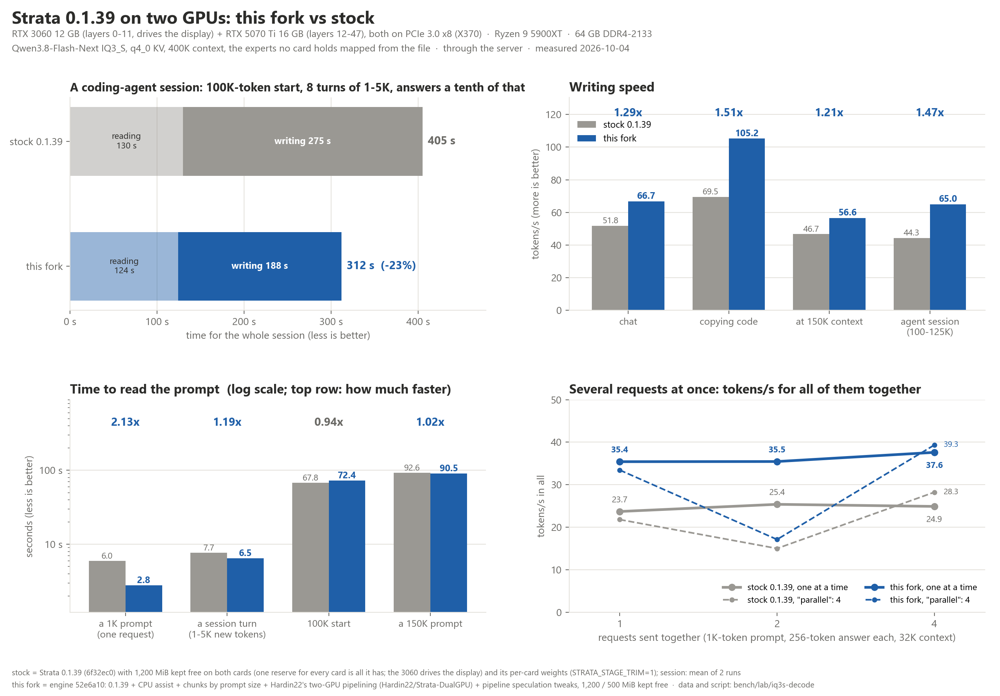
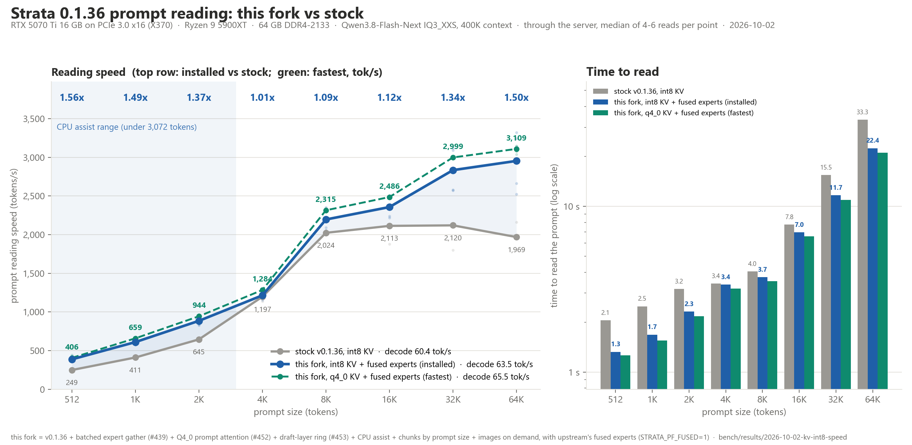

<h1 align="center">Strata</h1>

**English** · [简体中文](README.zh-CN.md) · [日本語](README.ja.md) · [Deutsch](README.de.md) · [Français](README.fr.md) · [Español](README.es.md) · [Português](README.pt-BR.md)

<p align="center"><b>Run a 125-billion-parameter AI model on your own gaming PC</b><br>
NVIDIA or AMD graphics card (12 GB or more) · Windows or Linux · free and open source</p>

<p align="center"><b>On two GPUs this fork gets through a coding agent's conversation in 6% less time than Strata 0.1.40.2</b> (7% on one GPU) and reads short prompts up to 1.9x as fast · <a href="#about-this-fork">about this fork</a></p>

<p align="center"><a href="https://github.com/Niko1221/Strata/releases/download/v0.1.10/Pagoda.mp4"></a><br>
<sub>A voxel pagoda garden, 1 shot prompt running on an RTX 5070 with Strata (IQ3_S, 128K context) ·
<a href="https://github.com/Niko1221/Strata/releases/download/v0.1.10/Pagoda.mp4">full video (49 s)</a></sub></p>

Strata runs **[Qwen3.8-Flash-Next](https://huggingface.co/Qwen/Qwen3.8-Flash-Next)** on a normal PC. This is a
large, smart AI model that usually needs a server. It chats, writes code, reads pictures and works with your apps
and coding agents. Nothing leaves your PC.

## About the `speed-work-0.1.40.2` branch

This branch lives in a personal fork of [architectds/Strata](https://github.com/architectds/Strata) (the speed fork
described next), which is itself a fork of [Niko1221/Strata](https://github.com/Niko1221/Strata), the original project.
The engine, the model support, the server and the web app are Niko1221's and the Strata contributors' work, under the
MIT licence in [`LICENSE`](LICENSE), and their commits are all in this branch's history. What this branch adds on top of
0.1.40.2 is a layer around the chat page: tool permissions and tools for the model (files, search, web, commands),
separate chats, and Electron and Tauri desktop apps (`desktop/`). It is listed in [`CHANGELOG.md`](CHANGELOG.md), and
was written with Claude Code.

## About this fork

This fork of [Niko1221/Strata](https://github.com/Niko1221/Strata) is tuned for speed. Its default branch, `best`, is
Strata v0.1.40.2 plus the changes below. Several of its changes are in Strata itself: Q4_0 KV prompt attention on
tensor cores ([#452](https://github.com/Niko1221/Strata/pull/452)), the draft layer's K/V in a ring with KV streaming
([#453](https://github.com/Niko1221/Strata/pull/453)) and batched expert gathers
([#439](https://github.com/Niko1221/Strata/pull/439), taken up as #372) since v0.1.38, prompt chunks of equal size
([#693](https://github.com/Niko1221/Strata/pull/693), opt-in: `STRATA_PREFILL_EQUAL=1`) since v0.1.40, and the CPU
share's reach - chunks up to 3,072 tokens, experts mapped from the file, a layer split
([#1414](https://github.com/Niko1221/Strata/pull/1414), opt-in: `STRATA_PREFILL_CPU_SHARE=auto`) - since v0.1.41,
which also turns its own CPU share on by default on one GPU for chunks below 1,024 tokens (this branch is not on 0.1.41
yet). The two-GPU work this fork carried on 0.1.39, from
[Hardin22/Strata-DualGPU](https://github.com/Hardin22/Strata-DualGPU), is in Strata too: pipelined verify windows,
each card keeping only its own layers' weights and a VRAM reserve per card since 0.1.40, as flags that are off by
default (see **Using it** below), and the asynchronous adaptive tier beside the pipelined windows and an AVX2 Q8_K
activation quantizer since 0.1.40.2. What the fork adds on top:

- **CPU share:** on prompts under 3,072 tokens the CPU computes part of the experts while the GPUs compute the rest,
  the experts mapped from the file too (NVIDIA builds; on by default on one card, `STRATA_SPLIT_CPU_ASSIST=1` on a
  layer split, `STRATA_PREFILL_CPU=0` turns it off). The fork has run it since 2026-10-01. Strata 0.1.40.2's own CPU
  share (`STRATA_PREFILL_CPU_SHARE`) takes only experts in page-locked RAM, so with the experts mapped, as here, it
  changes nothing (one card: 126.2 s with it, 126.1 s without). #1414 gave it this fork's limits; the fork's way of
  moving the activations, quantized on the GPU, is [#1416](https://github.com/Niko1221/Strata/pull/1416). The fork's
  lead over stock in the tables below is all in the reading, where the CPU share works.
- **The pipelined decode's lookahead** (two GPUs, `--pipeline-windows 2`): the window already known to be right is
  served first, a copy's prompt lookup carries on from one window to the next (also after a window the drafter's
  chain made), and a window runs ahead of its predecessor's verdict from a 10% estimate (upstream: 20%).
  `STRATA_PIPELINE_YIELD=0`, `STRATA_PIPELINE_LOOKUP_NEXT=0` and `STRATA_PIPELINE_LOOKUP_ANY=0` turn the parts off.
- **The prompt kernels by the number of cards:** upstream's fused int8 tensor-core experts (`STRATA_PF_FUSED=1`) on
  one card; on two cards the MMQ path (`STRATA_PF_FUSED=0`), which reads 6-7% faster there. These are settings:
  stock ran with the same ones in the tables below.

Images on demand (`--vision-on-demand`, in the fork's 0.1.38 build) is not in this build: it is to be rebuilt on the
segmented expert cache.

### Two GPUs and one: RTX 3060 12 GB + RTX 5070 Ti 16 GB (measured 2026-10-07, Strata 0.1.40.2)

A coding agent's conversation, the same for every engine: a 100K-token start, then 8 turns that each add 1-6K tokens
of code (28,690 tokens in all) and a question, replies capped at 128 tokens. The turns carry one recorded set of
answers, so every engine reads exactly the same tokens.

| | Stock 0.1.40.2 | This fork on 0.1.40.1 | This fork on 0.1.40.2 |
| --- | ---: | ---: | ---: |
| The conversation, two GPUs, IQ3_S | 137.4 s | 129.9 s | **128.7 s (-6% against stock)** |
| - reading its 100K-token start | 58.2 s | 59.2 s | 57.9 s |
| - reading its 8 turns | 62.9 s | 53.9 s | 54.2 s |
| - writing its 1,152 tokens | 16.3 s | 16.9 s | 16.5 s |
| The conversation, the RTX 5070 Ti alone, huihui-ai's Swift 1.5 IQ3_XXS | 126.1 s | 118.4 s | **116.8 s (-7%)** |

Short prompts, each one new (after an 8K-token warm-up), median of 5 reads, seconds, stock 0.1.40.2 / this fork on
0.1.40.2:

| | 512 tokens | 1,000 | 2,000 | 3,000 |
| --- | ---: | ---: | ---: | ---: |
| Two GPUs, IQ3_S | 3.45 / **2.04** | 4.51 / **2.66** | 6.38 / **3.81** | 6.73 / **5.11** |
| The RTX 5070 Ti alone, huihui IQ3_XXS | 3.32 / **1.72** | 3.99 / **2.34** | 5.41 / **3.26** | 5.53 / **4.12** |

- The conversation, one run each: stock and the fork on 0.1.40.1 ran in one window, the fork on 0.1.40.2 two hours
  later (129.8 s on two GPUs in a third window); against the fork on 0.1.40.1, in stock's own window, the lead is 5%
  (two GPUs) and 6% (one). Its stock on one GPU is the 0.1.40.2 build with only the fork's pipelined-decode commits,
  which run only with `--pipeline-windows 2`. The short prompts: stock and the fork in one window.
- On 0.1.40.1 this section said 146.7 s for stock against 127.8 s for the fork (-13%), but that stock run read with
  `STRATA_PF_FUSED=1`, 6-7% slower on two cards; every two-GPU column here reads with `STRATA_PF_FUSED=0`.
- One PC: the RTX 3060 runs layers 0-11 and drives the display, the RTX 5070 Ti layers 12-47 (both PCIe 3.0 x8 on an
  ASRock X370), Ryzen 9 5900XT, 96 GB DDR4-3200; q4_0 KV, 512K context, the experts no card holds mapped from the
  file; through the server. On one GPU the RTX 5070 Ti runs every layer.

### Two GPUs on 0.1.39 (measured 2026-10-04)

<p align="center"></p>

| | Stock 0.1.39 | This fork |
| --- | ---: | ---: |
| A coding-agent session: a 100K-token start, 8 turns of 1-5K new tokens, answers a tenth of that | 405 s | **312 s (-23%)** |
| Writes: a chat / copying code / at 150K context | 51.8 / 69.5 / 46.7 tokens/s | **66.7 / 105.2 / 56.6** |
| Reads: a 1K prompt / a session turn | 6.0 / 7.7 s | **2.8 / 6.5 s** |
| Reads: the 100K start / a 150K prompt | **67.8** / 92.6 s | 72.4 / **90.5 s** |
| Four 1K-token requests sent together, one at a time | 24.9 tokens/s in all | **37.6** |

- One PC: the RTX 3060 runs layers 0-11 and drives the display, the RTX 5070 Ti layers 12-47 (both PCIe 3.0 x8 on an
  ASRock X370), Ryzen 9 5900XT, 64 GB DDR4-2133; Qwen3.8-Flash-Next IQ3_S, q4_0 KV, 400K context, the experts no card
  holds mapped from the file; through the server. Stock keeps 1,200 MiB free on both cards (one reserve for every
  card is all it has, and the 3060 needs it for the desktop) with its per-card weights (`STRATA_STAGE_TRIM=1`); this
  fork 1,200 MiB on the 3060 and 500 on the 5070 Ti. The session is the mean of two stock runs against one of the
  fork (engine 52e6a10); on 0.1.38 the fork took 330-346 s for it.
- The fork reads the 100K start 7% slower than stock (not looked into yet); everywhere else it reads as fast or faster.
- 0.1.39's `"parallel": 4` (several conversations decoded together) changes little on this PC: four requests together
  gave 28.3 (stock) and 39.3 tokens/s (fork) in all, but each request then writes at 12-14 tokens/s, without drafts.
  Most experts run on the CPU here (the two cards hold about a third of them), so four conversations cost about what
  four requests cost one after the other; what it buys is the wait for the first token (the fourth request's 23 s ->
  12 s on the fork).

### One GPU: RTX 5070 Ti 16 GB (measured 2026-10-02, the fork's 0.1.36 build against Strata 0.1.36)

<p align="center"></p>

| Prompt | Stock 0.1.36 | This fork, int8 KV | This fork, q4_0 KV (fastest) |
| --- | ---: | ---: | ---: |
| 512 tokens | 249 tokens/s | 387 (1.56x) | 406 |
| 2K | 645 | 885 (1.37x) | 944 |
| 8K | 2,024 | 2,196 (1.09x) | 2,315 |
| 32K | 2,120 | 2,835 (1.34x) | 2,999 |
| 64K | 1,969 | 2,954 (1.50x) | 3,109 |
| Writes answers | 60.4 tokens/s | 63.5 | 65.5 |

Measured before the three PRs were in the stock engine (from v0.1.38 stock has them too, so its lead is smaller
there), on one card: RTX 5070 Ti 16 GB on PCIe 3.0 x16 (ASRock X370), Ryzen 9 5900XT, 64 GB DDR4-2133, the IQ3_XXS
model with a 400K context, through the server (median of 4-6 reads per size); stock with its default int8 KV cache.
q4_0 KV reads ~5% faster than int8, but its predictions drift about 3x as far from an fp16 cache, and more at long
context.

### How close is it to the official model?

The official Qwen 3.8 Flash (Alibaba's own service, through OpenCode's API) answered 31 prompts greedily with thinking
off: documents of 1K-32K tokens to continue or summarize, and easy, medium and hard short tasks - 14,960 answer tokens.
Strata then read exactly those answers, and at every token we checked whether it would have picked the same next
token (measured 2026-10-02 with the fork's 0.1.36 build on one RTX 5070 Ti; the two 0.1.39 rows on 2026-10-04,
the same card and answers):

| Local setup | Same next token as the official model | Where the official model was sure (69% of tokens) | Difference in the predictions (5-token KL) |
| --- | ---: | ---: | ---: |
| IQ3_XXS, int8 KV + fused experts | 92.6% | 99.9% | 0.064 |
| IQ3_XXS, q4_0 KV + fused experts (fastest) | 92.6% | 99.9% | 0.067 |
| IQ3_XXS, fp16 KV + FP16 experts (most exact) | 92.7% | 99.9% | 0.064 |
| IQ3_S, int8 KV + fused experts | 92.8% | 100.0% | 0.052 |
| IQ3_S, q4_0 KV + fused experts: stock Strata 0.1.39 (2026-10-04) | 93.0% | 100.0% | 0.054 |
| IQ3_S, q4_0 KV + fused experts: this fork's 0.1.39 build (2026-10-04) | 93.0% | 100.0% | 0.054 |
| The official model against itself, asked twice | 97.5%* | | 0.010 |

- **This fork's speed changes leave the predictions where stock's are:** on 0.1.39 (one RTX 5070 Ti, the same 31
  answers) the fork and stock pick the same next token at 99.6% of the positions; the 5-token KL between them is
  0.0006, less than the KV format moves them.
- **The gap is the 3-bit weights, not the speed settings:** the KV format and the fused experts move the predictions
  by 0.001-0.003; IQ3_S, with more bits per weight, closes about a fifth of the gap. (Whether the service runs
  exactly the open weights is not known; part of the gap may be that.)
- **By task:** step-by-step math 96.4%, code 94.3%, long documents 91-93%, free writing (a story, explanations)
  85.6% - where many words are equally good and the official model itself is least sure.
- **The official service is not deterministic either:** asked twice at temperature 0, its two answers parted at token
  9 (median); Strata's would part from it at token 8 (IQ3_XXS) or 13 (IQ3_S).

<sub>* over the 846 tokens before its two answers parted. Strata with fixed test settings (`--expert-cache 3600`,
IQ3_S 3000), the API's 5 most likely tokens per position (all it returns).</sub>

**Using it:** setup's ready-made engine is upstream's; for the engine changes above run setup with `--build` on this
branch (it compiles the engine: on Windows that needs the CUDA toolkit and Visual Studio Build Tools). The two-GPU
setup above is the config keys `"gpu": [1, 0]` (the display card first, so the faster card runs the head and the
draft layer), `"layer_split": "12"` and the arguments `--vram-reserve-mib 1200 --vram-reserve-later-mib 500
--pipeline-windows 2 --trim-stage-weights` (0.1.40 has the last two as opt-in flags), with `"env":
{"STRATA_SPLIT_CPU_ASSIST": "1", "STRATA_PF_FUSED": "0"}`; on one card the env is `{"STRATA_PF_FUSED": "1"}`. `main`
stays identical to upstream.

## How fast is it?

We measured it on two ordinary gaming PCs. A token is about ¾ of a word.

- **Writes answers:** how fast the reply appears in a short chat. 60 tokens per second is faster than you can read.
- **Reads your prompt:** how fast it takes in what you send (here a 32K-token document, code or chat history).

<table>
<tr><th>NVIDIA: RTX 5070 (12 GB), Ryzen 5 7600, 64 GB RAM</th><th>AMD: RX 9070 XT (16 GB), Ryzen 9 3900X, 47 GB RAM</th></tr>
<tr><td>

| Size | Writes answers | Reads your prompt |
| --- | ---: | ---: |
| **Q2_0** | 94 tokens/s | 2,650 tokens/s |
| **IQ2_XS** | 79 tokens/s | 2,090 tokens/s |
| **IQ3_XXS** | 62 tokens/s | 1,750 tokens/s |
| **IQ3_S** | 53 tokens/s | 1,620 tokens/s |
| **Coder** | 55 tokens/s | 2,180 tokens/s |

</td><td>

| Size | Writes answers | Reads your prompt |
| --- | ---: | ---: |
| **Q2_0** | 60 tokens/s | 1,160 tokens/s |
| **IQ2_XS** | 52 tokens/s | 1,110 tokens/s |
| **Coder** | 44 tokens/s | 1,420 tokens/s |

</td></tr>
</table>

NVIDIA: Q2_0 with engine 0.1.36, the other rows with 0.1.26 (4K answers, 32K prompts). The full tables are in
[DETAILS.md](docs/DETAILS.md#speed-measured). A card with more VRAM is faster: an RTX 3090 (24 GB) should write
about 100-140 tokens per second. Long chats and other cards: [speed of each model](docs/MODELS.md#how-fast-is-each-size),
[community results](docs/COMMUNITY_BENCHMARKS.md).

<p align="center"><a href="https://buymeacoffee.com/strataengine"></a><br>
<sub>Strata is free. If it runs well on your PC, a coffee keeps the work on it going.</sub></p>

## What you need

| | |
| --- | --- |
| **Graphics card** | **NVIDIA** GeForce RTX 20, 30, 40 or 50 series, or **AMD** Radeon RX 7900 XT / XTX, RX 7800 XT / 7700 XT, RX 9060 XT, RX 9070 / 9070 XT, Radeon AI PRO R9700 or RX 6800 / 6900 series. It needs **12 GB of VRAM or more**. |
| **RAM** | 32 GB or more. Your RAM decides [which model](#which-model-should-i-pick) fits. 64 GB runs every size. |
| **Disk** | About 80 GB free. Use an SSD if you can: the first start is much faster. |
| **System** | Windows 10 / 11 or Linux, and a current graphics driver from NVIDIA or AMD. |

The installer sets up everything else. Two or three cards can share the model ([multi-GPU](docs/MULTI_GPU.md)).

Experimental, written and tested by community members on their own machines:

- **Older graphics cards** (Tesla P40 / V100, GTX 10, Radeon VII / MI50, RX 6700 XT, RX 5500 XT): [Older GPUs](docs/OLDER_GPUS.md).
- **Intel Arc**, built from source on Linux: [Intel Arc](docs/INTEL_ARC.md).
- **AMD Ryzen AI Max (Strix Halo)**, built from source on Linux: [Strix Halo](docs/STRIX_HALO.md).
- **Older processors without AVX2**: they work, but slowly. [Older CPUs](docs/INSTALL.md#older-cpus-experimental).

The full list: [docs/INSTALL.md](docs/INSTALL.md#what-you-need).

## Install

### Let your AI set it up

Do you use an AI coding assistant (Claude Code, Cursor, Codex, GitHub Copilot, ...)? Paste this into it:

```text
Set up Strata on this PC for me: https://github.com/Niko1221/Strata - follow docs/AI_SETUP.md in that repository.
```

It checks your graphics card, RAM and disk and picks the model that fits. Then it installs and starts it and tells
you how to connect your apps. AI tools can also install, start and stop Strata through its
[MCP server](docs/MCP_SERVER.md).

### Or do it yourself

[Download Strata](https://github.com/Niko1221/Strata/archive/refs/heads/main.zip) and unzip it (or `git clone` it).
**Windows:** double-click **`START-HERE.bat`**. **Linux:** run **`./setup.sh`** in the Strata folder.

The steps are the same for NVIDIA and AMD. The installer finds your card and sets up the right engine for it. It
asks you a few questions:

- which model and which size,
- how much context (how much text the model keeps in mind),
- whether it should read pictures.

Press Enter each time for the recommended answer. Then it downloads the model (about 70 GB) and starts it. If the
download stops, run it again: it continues where it left off. Your browser opens the Strata app at
`http://127.0.0.1:8080`.

> **While the model starts, your PC can be slow or stop responding for 1-3 minutes** (longest the first time).
> Strata loads 35-55 GB into your RAM and locks part of it for the graphics card. This is normal. Wait, and don't
> close the window. The window shows what Strata is doing.

**Next time**, run `START-HERE.bat` (or `./setup.sh`) again. It starts right away and downloads nothing twice. Close
its window to stop the model. `UPDATE.bat` (`./update.sh`) updates Strata without starting it. Updating, Docker,
several cards, where the files go and every option: [docs/INSTALL.md](docs/INSTALL.md).

## Which model should I pick?

The installer recommends one for your RAM. The same model comes in several sizes, compressed more or less. Smaller
sizes are faster. Larger sizes are a bit smarter.

| Your RAM | Take | Why |
| --- | --- | --- |
| **32 GB** | **Coder** | it fits 32 GB, and it is made for code (with a 24 GB card, Q2_0 and IQ2_XS run too) |
| **48 GB** | **IQ2_XS** (or Q2_0, the fastest) | the larger sizes do not fit |
| **64 GB** | **IQ2_XS** (recommended), or IQ3_XXS / IQ3_S | every size fits; IQ3_S is the best and the slowest |
| **96 GB or more** | **IQ3_S**, or Unsloth's UD-IQ4_XS (~4-bit) | room for the largest sizes with everything else open |

- **[Coder](docs/MODELS.md#coder):** a coding version with half of the experts removed. It reaches 91% of the full
  model's SWE-bench Verified score (measured by its authors) and fits 32 GB of RAM. It is weaker outside code,
  including Chinese and other CJK text (#438). For those, take Q2_0, IQ2_XS or IQ3_S, which keep every expert.
- **[Swift 1.5](docs/MODELS.md#swift-15):** a fine-tune that thinks for a much shorter time before it answers. You
  get the answer sooner, at about the same quality.
- **[Unsloth UD-IQ4_XS](docs/MODELS.md#unsloth-ud-iq4_xs):** Unsloth's ~4-bit version, between IQ3_S and
  UD-Q4_K_XL in quality. A 94 GB download. With less than ~80 GB of RAM, Strata reads part of it from the SSD
  while it answers, so it is slower there (an NVMe SSD helps).
- **[Unsloth UD-Q4_K_XL](docs/MODELS.md#unsloth-ud-q4_k_xl-experimental)** (experimental): the closest to the full
  model. But Strata reads most of it from the SSD while it answers, so it writes only 7-8.5 tokens/s on a 64 GB PC.
- **[OrcaRouter's Uncensored IQ3_XXS](docs/MODELS.md#orcarouter-uncensored-iq3_xxs):** you set it up by hand. It is
  not in the installer's menu.

Sizes, downloads and what fits where: [docs/MODELS.md](docs/MODELS.md). To add another model later, run
`SETUP.bat` (Linux: `./setup.sh --setup`).

## Using it

<p align="center"><br>
<sub>The Strata app's <b>Monitor</b> (left) while a coding agent writes the pagoda garden from the video (right)</sub></p>

- **In the browser:** open `http://127.0.0.1:8080`. It has **Chat**, a live **Monitor** of the model and your
  GPU/CPU/RAM, and **About** with the settings and addresses.
- **Your apps and coding agents:** add an "OpenAI-compatible" provider with the base URL
  **`http://127.0.0.1:8080/v1`**. Any API key and any model name work.
  - Apps that use Anthropic's API: `http://127.0.0.1:8080/v1/messages` (Claude Code:
    `ANTHROPIC_BASE_URL=http://127.0.0.1:8080`).
  - Codex CLI and other apps that use the OpenAI Responses API: `/v1/responses`
    ([setup](docs/DETAILS.md#the-responses-api-and-codex-cli)).
- **Thinking:** choose **off, low, medium or high** in the chat menu or in your app's "reasoning effort". Off is the
  fastest. High is best for hard questions.
- **Pictures:** say yes to "Images?" in setup. Then click **Picture** in the chat, or attach pictures in your app.
  AMD cards read pictures on Linux through the processor; on Windows they can't yet.
- **From your phone or another PC:** `START-HERE.bat --setup --host 0.0.0.0 --api-key <secret>`. Always set a key.
- **One request at a time:** by default Strata answers one request, and the others wait. To answer several at once,
  set `"parallel": 2` ([BATCHING.md](docs/BATCHING.md)). On a 12 GB card this makes each answer slower.
- **Long prompts:** Strata reads the first message of a chat in full, about 1 minute per 30,000 tokens. Follow-up
  messages start in seconds.

More: [where your chats are stored](docs/INSTALL.md#where-things-are-stored), [the API](docs/DETAILS.md#using-it).

## Something went wrong?

- **My PC froze the first time Strata started.** This is normal while it loads the model. Wait, and don't close the
  window. Still frozen after 10 minutes? Restart the PC, close other programs and try again, or pick a smaller size.
- **It stopped while downloading or installing.** Run `START-HERE.bat` (or `./setup.sh`) again. It continues where
  it stopped.
- **It's very slow and the disk light keeps blinking, or it says "the engine stopped unexpectedly".** Your PC does
  not have enough free RAM. Close other programs (browsers use a lot), or pick a smaller size (Q2_0 or IQ2_XS).
- **It says port 8080 is already in use.** Strata is already running. Look for its window.

More problems and their fixes: [docs/TROUBLESHOOTING.md](docs/TROUBLESHOOTING.md). Still stuck? Open an
[issue](https://github.com/Niko1221/Strata/issues) and attach `strata-<model>.log` from the Strata folder. Found a
security problem? Report it privately: [SECURITY.md](SECURITY.md).

## How does it work?

Models like this one usually run on servers with hundreds of gigabytes of graphics memory. Your graphics card has
12-24 GB. Strata makes the model fit by **sharing the work across your whole PC**. Think of a kitchen: the things
you use all the time stay on the counter, and the rest waits in the pantry.

<p align="center"></p>

- **The model is a team of 24,576 small specialists ("experts").** Each word needs only 10 of them.
- **Your graphics card** keeps the few thousand experts that are used most often. **Your RAM** holds all of them,
  and **your processor** works on the rest at the same time. **Your SSD** holds a big lookup table.

<p align="center"></p>

- **Guess, then check:** a small helper guesses the next few words. The big model checks them all at once. You get
  the same answer, 1.6-1.8x sooner.
- **Long texts are read in big pieces** (up to 8,192 tokens at a time), at over 1,000 tokens per second.

The longer explanation: [docs/HOW_IT_WORKS.md](docs/HOW_IT_WORKS.md). Every part and its numbers:
[the details](docs/DETAILS.md#how-it-works) and the [paper](docs/paper/Strata-Paper.pdf).

## Credits and license

The model is [Qwen3.8-Flash-Next](https://huggingface.co/Qwen/Qwen3.8-Flash-Next) by the Qwen team. It was
compressed by [ISTA-DASLab](https://huggingface.co/ISTA-DASLab/Qwen3.8-Flash-Next-GSQ-RCO-GGUF), UkisAI (Swift 1.5)
and Unsloth. Strata uses parts of [llama.cpp / ggml](https://github.com/ggml-org/llama.cpp). All credits:
[docs/HOW_IT_WORKS.md](docs/HOW_IT_WORKS.md#credits). Strata is open source under the [MIT License](LICENSE). A few
parts and every model have their own licenses ([which ones](docs/HOW_IT_WORKS.md#license)).

## Support Strata

Strata is free and open source. If it is useful to you, you can support its development:

<p align="center"><a href="https://buymeacoffee.com/strataengine"></a></p>
